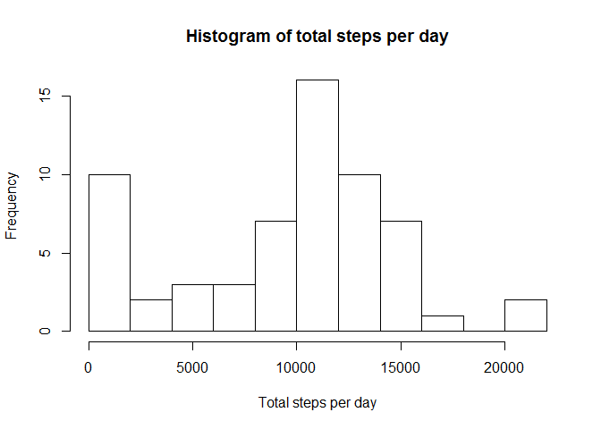
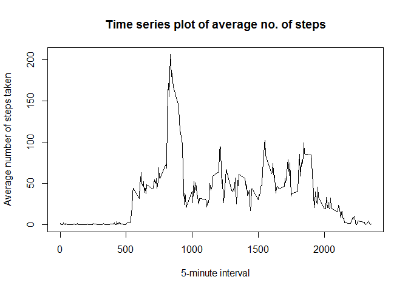
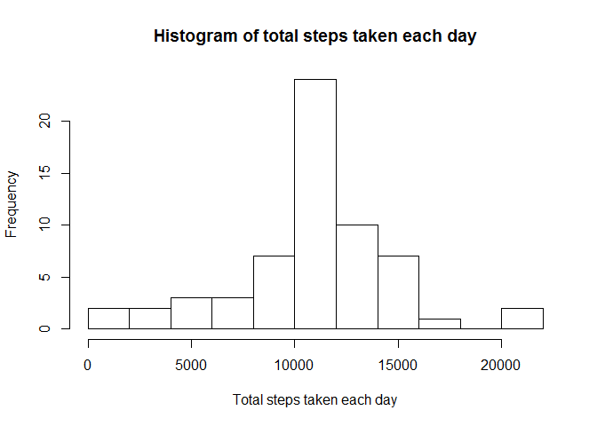
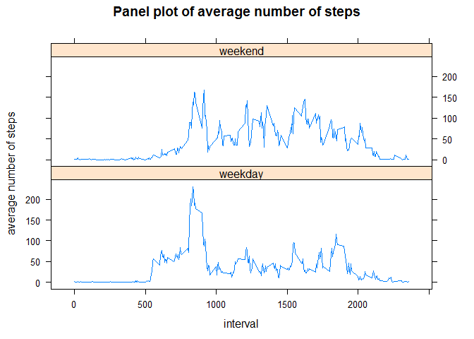

# Reproducible Research: Peer Assessment 1

## Loading and preprocessing the data
First off, we will load the data using `read.csv()` and transform the date variable from character to date type.

```r
unzip(zipfile="activity.zip")
activity.data <- read.csv("activity.csv", stringsAsFactors=FALSE, comment.char="")
activity.data$date <- as.Date(activity.data$date, "%Y-%m-%d")
```

## What is mean total number of steps taken per day?
Total number of steps can be calculated by:

```r
steps.per.day <- tapply(activity.data$steps, activity.data$date, sum, na.rm=TRUE)
```
Histogram of total number of steps each day can be plotted as:

```r
hist(steps.per.day, main="Histogram of total steps per day", xlab="Total steps per day", breaks=10)
```

 
Mean and Median of the total number of steps can be calcutaed as:

```r
mean.before.imputation <- mean(steps.per.day, na.rm=TRUE)
median.before.imputation <- median(steps.per.day, na.rm=TRUE)
mean.before.imputation
```

```
## [1] 9354.23
```

```r
median.before.imputation
```

```
## [1] 10395
```

## What is the average daily activity pattern?
To see the average daily pattern, we will first calculate average number of steps taken,
in each interval, followed by the time-series plot:

```r
steps.per.interval <- aggregate(steps ~ interval, data = activity.data,
                                FUN = mean)
plot(steps ~ interval, data = steps.per.interval, type = "l",
     main = "Time series plot of average no. of steps",
     xlab = "5-minute interval",
     ylab = "Average number of steps taken")
```

 
The 5-minute interval containing maximum number of steps can be identified as:

```r
steps.per.interval$interval[steps.per.interval$steps==max(steps.per.interval$steps)]
```

```
## [1] 835
```

## Imputing missing values
Total number of rows containing missing data can be calculated as:

```r
sum(is.na(activity.data))
```

```
## [1] 2304
```
Since **steps** is an interval variable, it makes sense to use the mean for the corresponding 5-minute interval as the replacement for missing values (NAs).
Let's first calculate mean no. of steps for each interval in the dataset:

```r
mean.steps.per.interval <- aggregate(activity.data$steps, by=list(activity.data$interval), mean, na.rm=TRUE)
names(mean.steps.per.interval) <- c("interval", "meansteps")
head(mean.steps.per.interval)
```

```
##   interval meansteps
## 1        0 1.7169811
## 2        5 0.3396226
## 3       10 0.1320755
## 4       15 0.1509434
## 5       20 0.0754717
## 6       25 2.0943396
```
Next, let's copy old data into a new dataset which we will modify by filling up NAs with appropriate mean values.

```r
new.activity.data <- activity.data
```
As of now, `new.activity.data` contains missing data, which can be seen below:

```r
head(new.activity.data)
```

```
##   steps       date interval
## 1    NA 2012-10-01        0
## 2    NA 2012-10-01        5
## 3    NA 2012-10-01       10
## 4    NA 2012-10-01       15
## 5    NA 2012-10-01       20
## 6    NA 2012-10-01       25
```

```r
sum(is.na(new.activity.data))
```

```
## [1] 2304
```
In order to subsitute mean values of number of steps into this dataset, we will run the following loop:

```r
for (i in 1:nrow(new.activity.data)) {
    if(is.na(new.activity.data$steps[i])) {
        new.activity.data$steps[i] <- mean.steps.per.interval[which(new.activity.data$interval[i]==mean.steps.per.interval$interval), ]$meansteps
    }
}
```
Now, let's see if the above code indeed replace missing values in the new dataset 
`new.activity.data`

```r
head(new.activity.data)
```

```
##       steps       date interval
## 1 1.7169811 2012-10-01        0
## 2 0.3396226 2012-10-01        5
## 3 0.1320755 2012-10-01       10
## 4 0.1509434 2012-10-01       15
## 5 0.0754717 2012-10-01       20
## 6 2.0943396 2012-10-01       25
```

```r
sum(is.na(new.activity.data))
```

```
## [1] 0
```
Histogram of total number of steps each day can be plotted as:

```r
steps.each.day <- tapply(new.activity.data$steps, new.activity.data$date, sum)
hist(steps.each.day, main="Histogram of total steps taken each day", xlab="Total steps taken each day", breaks=10)
```

 
Mean and Median of the total number of steps can be calcutaed as:

```r
mean.after.imputation <- mean(steps.each.day)
median.after.imputation <- median(steps.each.day)
mean.after.imputation
```

```
## [1] 10766.19
```

```r
median.after.imputation
```

```
## [1] 10766.19
```
Now let's compare mean and median values before and after imputation:

```r
estimates <- data.frame(mean=c(mean.before.imputation, mean.after.imputation), 
                        median=c(median.before.imputation, median.after.imputation))
rownames(estimates) <- c("before", "after")
estimates
```

```
##            mean   median
## before  9354.23 10395.00
## after  10766.19 10766.19
```
As we can see, there's an increment in the values of both, mean and median, with the jump being more significant in former as compared to latter. That is due to the fact that NAs are treated as `0`'s while calculating these measures of central tendency.

## Are there differences in activity patterns between weekdays and weekends?
We'll start by calculating a new variable called `day` which is based off the `weekday()` function applied to `date` variable.
Next, we'll create a factor variable called `indicator`, with two levels - "weekday" and "weekend".

```r
new.activity.data$day <- weekdays(new.activity.data$date)
for (i in 1:nrow(new.activity.data)) {
    if(new.activity.data$day[i] %in% c("Monday", "Tuesday", "Wednesday", "Thursday", "Friday")) 
        new.activity.data$indicator[i] <- "weekday"
    else
        new.activity.data$indicator[i] <- "weekend"
}
new.activity.data$indicator <- as.factor(new.activity.data$indicator)
table(new.activity.data$indicator)
```

```
## 
## weekday weekend 
##   12960    4608
```
Finally, let's make a panel plot to visualize if there is, at all, any difference in activity patterns between weekdays and weekends.

```r
avg.steps <- aggregate(steps ~ interval + indicator, data=new.activity.data, mean)
library(lattice)
xyplot(avg.steps$steps ~ avg.steps$interval | avg.steps$indicator, layout=c(1,2), 
       type="l", main="Panel plot of average number of steps", 
       xlab="interval", ylab="average number of steps")
```

 
